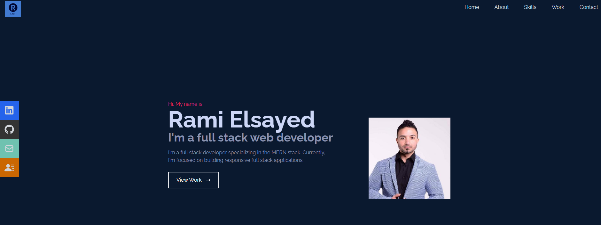

# my-react-portfolio 

## Table of Contents

- [Description](#description)
- [Deployed Link](#deployed-link)
- [Github Repository Link](#github-repository-link)
- [Screenshot](#screenshot)
- [Installation](#installation)
- [Usage](#usage)
- [Contributing](#contributing)
- [Tests](#tests)
- [Questions](#questions)

## Description

A react portfolio using tailwindcss and daisyui.

## Deployed Link

[deployment Link](https://ramielsayed.github.io/my-react-portfolio/)

## Github Repository Link

https://github.com/RamiElsayed/my-react-portfolio.git

## Screenshot

## Installation

Please follow the instructions below:

None

## Usage

Please follow the instructions below:

None

## License

This Project is licensed under the MIT License, for more information please visit: [License](https://choosealicense.com/licenses/mit/)

## Contributing

None

## Tests

Please follow the instructions below:

None

## Questions

Please contact me on my email: ramielsayed123@outlook.com
